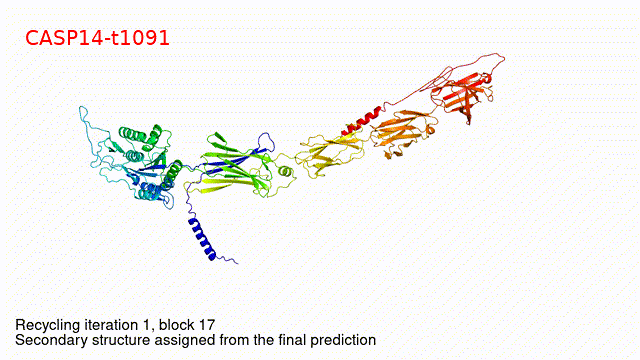

# Hello, welcome!

I currently work on multiomics analysis in particular proteogenomics, whose generic features are collated for reproducible research.




The figure above is generated from https://doi.org/10.1038/s41586-021-03819-2 (Supplementary video 4) with script,

```bash
# https://cambridge-ceu.github.io/csd3/systems/ceuadmin.html
module load ceuadmin/ffmpeg
ffmpeg -i jumper21s4.mp4 -ss 8 -t 8 s4.mp4
ffmpeg -i s4.mp4 -f gif s4.gif
ffprobe s4.gif
ffmpeg -i s4.gif -s 640x360 CASP14-t1091.gif
ffmpeg -i CASP14-t1091.gif -vf "drawtext=fontsize=20:text='CASP14-t1091':fontcolor=red:x=25:y=30" CASP14-t1091-text.gif
```
